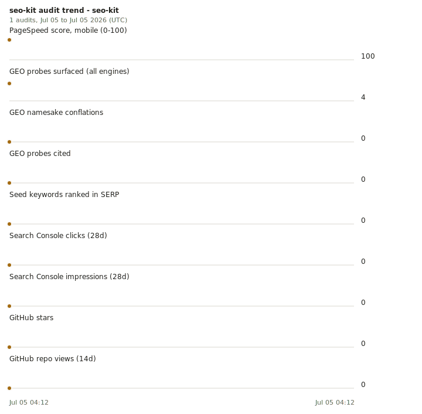

# seo-kit

A real-data SEO and GEO (generative-engine optimization) audit toolkit you point at any site by URL. It measures how a surface is seen by three audiences at once and turns the gaps into a ranked punch list:

1. **Search crawlers** (Google, Bing): titles, structured data, Core Web Vitals, sitemaps.
2. **Platform-internal search** (GitHub, recruiter search): repo topics, descriptions, keyword hygiene.
3. **LLM answer engines** (the GEO layer): is the content even readable without JavaScript, and does an LLM surface and correctly identify you.

The guiding rule: the free Tier-0 core delivers most of the value with zero spend, and every paid source is opt-in. Nothing paid runs, or needs an account, until you turn it on.

## Three ways to run it

- **Portable (zero config):** pass a raw URL (`seo-kit audit https://example.com`). The URL-only providers (crawl, psi) run and give a universal technical/on-page audit on any site; the providers that need per-target config skip cleanly, so portable mode never spends. This makes seo-kit a skill you can drop on any repo's site.
- **Per-repo (modular):** run `seo-kit setup` inside a repo to scaffold `seo-kit.toml` there: url and github_repo are inferred, the semantic fields (positioning, seed keywords, GEO entity markers/probes) are left as commented templates to fill. Its surfaces resolve local-first and its reports land in the repo's own `seo-reports/`, so config and audit history travel with the repo. No secrets in the file; safe to commit.
- **Global registry (tool home):** targets with no repo of their own go in this repo's `surfaces.toml` with the same fields.

## Why it exists

Most "AI SEO" tooling either hallucinates numbers (keyword volumes with no data source) or hides everything behind a subscription. seo-kit pairs the model with real data: Search Console, PageSpeed, Bing, GitHub, and Google Trends are all free and official. The model's job is synthesis and prioritization, not inventing metrics.

## Architecture

Every data source is a `Provider` behind one interface. The orchestrator runs the enabled ones, collects ranked findings, and writes a markdown + JSON report. A target is a raw URL (synthesized on the fly), a per-repo `seo-kit.toml` surface (nearest one walking up from cwd wins), or a tool-home `surfaces.toml` surface; providers that lack the config a URL cannot supply (Search Console property, repo, seed keywords, GEO entity) skip cleanly and say what to add.

Config is layered: machine-level (secrets, provider enablement, token caches) stays in the tool home; target-level (surface definitions, report output) lives with each audited repo.

```
tool home (this repo)
  config.toml    optional overrides of the built-in defaults (Tier 0 on; paid tiers opt-in); gitignored, cp config.toml.example
  surfaces.toml  global registry: targets without a repo of their own
  .env           secrets (gitignored; plain environment variables work too and take precedence)
each audited repo
  seo-kit.toml   its surfaces + reports_dir (`seo-kit setup` scaffolds it; no secrets, committable)
  seo-reports/   its audit history
seokit/
  config.py      surface model + raw-URL synthesis + local-config discovery + provider defaults
  setup.py       per-repo scaffold: infer url/github_repo, template the semantic fields
  providers/     crawl, psi, gsc, github, bing, trends, dataforseo, serper, geo_probe  +  paid stubs
  audit.py       orchestrator
  report.py      markdown + json, labels stubbed tiers honestly
  cli.py         seo-kit setup | audit <url|surface> | providers | auth gsc
```

| Tier | Providers | Cost | State |
|------|-----------|------|-------|
| 0 | crawl, psi, gsc, github, bing, trends | free | implemented |
| 1 | dataforseo, serper | cheap pay-as-you-go | implemented |
| 2 | geo_probe (Perplexity/OpenAI/Anthropic/Gemini) | usage | implemented |
| 3 | ahrefs, semrush | subscription | stub |

## Quickstart

```bash
uv sync
uv run seo-kit audit https://example.com        # zero keys, zero config: crawl runs, everything else skips and says why
cp .env.example .env                            # fill the Tier-0 keys you want (PageSpeed, Search Console OAuth client, Bing, GitHub)
uv tool install --editable ".[google,trends]"   # global command; then, in any repo with a site:
seo-kit setup                                   #   scaffold that repo's seo-kit.toml (infers url + github repo)
seo-kit audit example.com                       #   full configured set; reports -> that repo's seo-reports/
```

The crawl provider alone, with no keys, will tell you whether your site is a client-rendered shell that LLM crawlers can't read, and whether it ships any structured data. That is usually the highest-leverage finding.

Provider on/off defaults are built in (Tier 0 on, paid tiers off); to change them, `cp config.toml.example config.toml` and flip flags there. Secrets are ordinary environment variables — `.env` at the tool home is a convenience, and variables already set in your shell win.

## Use it as a Claude Code skill

`SKILL.md` at the repo root is a [Claude Code agent skill](https://code.claude.com/docs/en/skills) that teaches the agent the whole workflow: portable audits, per-repo setup, and reading the reports. The repo is its own [plugin marketplace](https://code.claude.com/docs/en/plugin-marketplaces), so installing is two commands inside Claude Code:

```
/plugin marketplace add johncarmack1984/seo-kit
/plugin install seo-kit@seo-kit
```

Then "audit example.com for SEO" in any session picks it up; `/plugin update seo-kit@seo-kit` pulls the latest (versions track main). The engine still lives in a clone - the skill's one-time setup covers `uv tool install --editable` from it, and keys stay in that clone's `.env`.

No plugin support? The manual registration works the same as ever: symlink `SKILL.md` into `~/.claude/skills/seo-kit/`, or drop a project-scoped copy in a repo's `.claude/skills/seo-kit/`.

## Dogfooding

seo-kit audits itself. `seo-kit.toml` at the root registers this repo as a surface — the same file `seo-kit setup` scaffolds, filled in for real — with the project site ([seo-kit.johncarmack.com](https://seo-kit.johncarmack.com/), S3 + CloudFront, Terraform in `infra/`) as the URL and this repo as the GitHub layer. `seo-kit audit seo-kit` from anywhere in the repo; history lands in `seo-reports/`. The first self-audit forced a feature (per-surface `providers` allowlists), and the site in `site/` has to pass the crawl checks it ships.

`seo-kit trend seo-kit` turns the report history into the Measure phase: a per-metric table plus a small-multiples SVG (dark/light aware). The graph feeds itself: the self-audit workflow re-runs daily and after every successful deploy, stores each report in the site bucket's `audits/` prefix (no bot commits — `main` takes PRs only), regenerates the SVG from the full history, and publishes it straight to the site. Committed `seo-reports/` are the hand-curated milestones; the embed below shows the milestone copy, the [live one](https://seo-kit.johncarmack.com/trend-seo-kit.svg) updates on its own. The same series is published as data at [`audits/history.json`](https://seo-kit.johncarmack.com/audits/history.json) — the daily optimizer reads it so a verdict quotes a past reading instead of recalling one. Both public artifacts omit Search Console metrics by design; GSC stays in local, hand-curated audits.

The loop also closes: a scheduled Claude Code run ([OPTIMIZER.md](OPTIMIZER.md)) wakes after each daily audit, reads the findings and the trend, makes at most one measurement-grounded change to the site/docs/probe config, verifies the result against seo-kit's own crawl on localhost, and opens a PR. The branch ruleset means nothing lands without a human merge, and the next day's audit measures whatever did.



## Honesty about limits

Search Console lags about two days and only spans 16 months. Keyword volumes from any tool are modeled estimates. LinkedIn has no real SEO API. GEO probe results are non-deterministic and shift with model versions, so they're read as trends across repeated runs, not single answers. SEO feedback loops are weeks to months and confounded; improvements are attributed by trend, not instant causation.

## Roadmap

- Config-home discovery (`SEO_KIT_HOME`, then `~/.config/seo-kit`) so non-editable installs find their `.env`/config; PyPI release once that lands. Today the tool home is the cloned repo, which is why the install is `uv tool install --editable`.
- Implement the Tier-3 fetches (ahrefs, semrush) behind the existing stub contracts.

## License

MIT.
